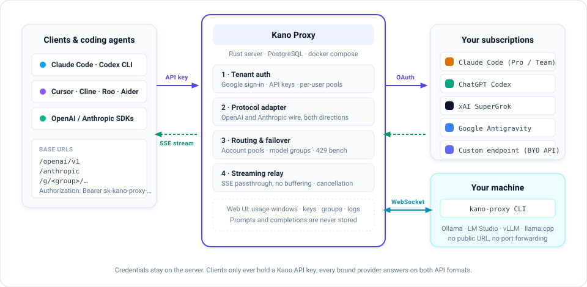

# Kano Proxy

<p align="center">
  <strong>Turn your AI subscriptions into unified OpenAI- & Anthropic-compatible APIs.</strong>
</p>

<p align="center">
  <a href="./README.md">English</a> · <a href="./README.zh-TW.md">繁體中文</a>
</p>

<p align="center">
  
  
  
  
  
  
</p>

---

**Kano Proxy** is a high-performance, multi-tenant proxy designed for developers and coding agents. Bind your personal AI subscription accounts (Claude Code, ChatGPT Codex, SuperGrok, Google AI Pro/Ultra), pool them together with automatic failover, and access everything through standard OpenAI and Anthropic endpoints.

Your upstream OAuth credentials never leave the server; clients only use isolated, project-issued API keys.

> **Want to use it right away?**
> A hosted instance is live at [kano-proxy.yuufeng.com](https://kano-proxy.yuufeng.com).

---

## Key Features

- **Mix & Match Any Model in Any Agent** — Run **GPT & Gemini inside Claude Code**, or run **Claude & Grok inside Cursor and Cline**. Full bidirectional protocol translation means your tools are no longer locked to a single model provider.
- **Multi-Account Pooling & Failover** — Pool multiple accounts per provider. Hit a rate limit (429/403)? Kano automatically fails over to the next available account.
- **Model Groups & Custom Providers** — Create virtual model aliases (e.g. `fast-code` → fallback across providers) or bring your own custom OpenAI/Anthropic-compatible endpoints.
- **Visual Usage Dashboard** — Track real-time 5h and weekly quota usage per account in a clean Web UI.
- **Privacy by Default** — Prompts and completions are never logged or stored.
- **Built for Coding Agents** — Zero-buffering SSE streaming, full tool calling / function calling, vision, audio input, reasoning effort mapping, and Anthropic prompt caching passthrough.

---

## How It Works

<p align="center">
  
</p>

1. **Sign In** with Google via the Web UI.
2. **Bind** your subscription accounts (Claude Code, Codex, Grok, Antigravity).
3. **Generate** a Kano API key (`sk-kano-proxy-...`).
4. **Point** your tools (Cursor, Claude Code, Cline, CC Switch, Aider, OpenAI SDK) to Kano Proxy.

---

## Quick Start

### 1. Endpoint URLs

| Protocol | Base URL | Supported Clients |
|---|---|---|
| **OpenAI-compatible** | `https://<your-domain>/openai/v1` | Codex CLI, Cursor, Cline, Roo Code, Aider, CC Switch, OpenAI SDK |
| **Anthropic Messages** | `https://<your-domain>/anthropic` | Claude Code CLI, Anthropic SDK, Claude-shaped tools |

The OpenAI-compatible base serves both **Chat Completions** (`/chat/completions`) and the **Responses API** (`/responses`), the wire the Codex CLI speaks. Codex models pass through to your ChatGPT subscription natively on it; every other provider is converted on the fly.

### 2. Authentication

```http
Authorization: Bearer sk-kano-proxy-...
```
*(Anthropic clients can also use `x-api-key: sk-kano-proxy-...`)*

### 3. Model IDs

Use standard `provider/model` naming on **both** endpoints:

- `claude-code/claude-opus-5` / `claude-code/claude-sonnet-5`
- `codex/gpt-5.6-sol`
- `grok/grok-4.5`
- `antigravity/gemini-3-flash`
- `<custom-slug>/<model-name>`

---

## Integration Examples

### Run GPT & Gemini directly in Claude Code

Point the Claude Code CLI at Kano Proxy to use OpenAI or Gemini models with native tool calling:

```bash
export ANTHROPIC_BASE_URL="https://<your-domain>/anthropic"
export ANTHROPIC_API_KEY="sk-kano-proxy-..."

# Run Claude Code powered by GPT or Gemini
claude --model codex/gpt-5.6-sol
# or
claude --model antigravity/gemini-3-flash
```

### Run the Codex CLI through the proxy

Add Kano Proxy as a model provider in `~/.codex/config.toml`. Codex models pass through natively on the CLI's own Responses wire; any other model id from your Models page (`claude-code/...`, `antigravity/...`) works in the same slot:

```toml
model = "codex/gpt-5.6-sol"
model_provider = "kano"
model_catalog_json = "kano-models.json"  # so /model lists codex/... ids; see the docs

[model_providers.kano]
name = "Kano Proxy"
base_url = "https://<your-domain>/openai/v1"
experimental_bearer_token = "<your-api-key>"
wire_api = "responses"
```

### Run Claude in Cursor / OpenAI SDK

Point any OpenAI-compatible client at `/openai/v1`:

```bash
curl https://<your-domain>/openai/v1/chat/completions \
  -H "Authorization: Bearer sk-kano-proxy-..." \
  -H "Content-Type: application/json" \
  -d '{
    "model": "claude-code/claude-sonnet-5",
    "messages": [{"role": "user", "content": "Write a quicksort in Rust."}],
    "stream": true
  }'
```

---

## Supported Providers

| Provider | Upstream Source | Multi-Account Pool |
|---|---|:---:|
|  | Anthropic Claude Pro / Team OAuth |  |
|  | ChatGPT Plus / Team / Pro (Codex Backend) |  |
|  | xAI SuperGrok OAuth |  |
|  | Google AI Pro / Ultra (CloudCode API) |  |
|  | Any OpenAI- or Anthropic-compatible API |  |

---

## Self-Hosting & Development

A Rust server and a PostgreSQL database, run with docker compose on a machine you control.

```bash
git clone https://github.com/yufeng-kano/kano-proxy.git
cd kano-proxy
cp .env.example .env     # fill it in
docker compose up -d --build
```

Each app installs and builds on its own — there is no repository-wide package manifest.

```bash
cd apps/server && cargo test --workspace
cd apps/cli    && cargo test
cd apps/web    && pnpm install && pnpm typecheck && pnpm build
cd apps/docs   && pnpm install && pnpm build
```

Configuration, TLS, migrations and releases are in [docs/deployment.md](./docs/deployment.md); the architecture is in [docs/rust-server.md](./docs/rust-server.md).

---

## Documentation

- [Architecture & Product Specs](./docs/product.md)
- [API Reference & Protocol Mapping](./docs/api.md)
- [Authentication & Account Pools](./docs/auth.md)
- [Providers & Failover Strategies](./docs/providers.md)
- [Full Documentation Map](./docs/index.md)

---

## License

MIT
