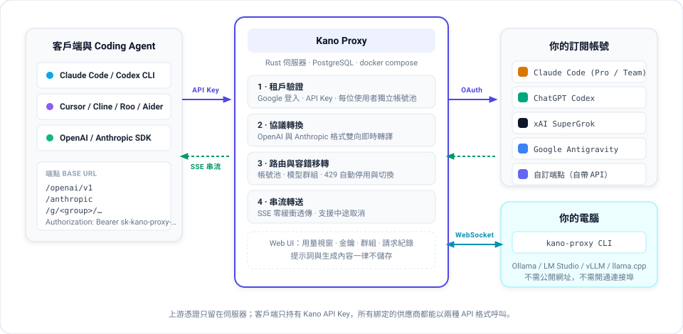

# Kano Proxy

<p align="center">
  <strong>將你的 AI 訂閱轉化為標準 OpenAI 與 Anthropic API 介面。</strong>
</p>

<p align="center">
  <a href="./README.md">English</a> · <a href="./README.zh-TW.md">繁體中文</a>
</p>

<p align="center">
  
  
  
  
  
</p>

---

**Kano Proxy** 是一套專為開發者與編程代理（Coding Agents）打造的高效能多租戶代理系統。你可以輕鬆綁定個人的 AI 訂閱帳號（Claude Code、ChatGPT Codex、SuperGrok、Google AI Pro/Ultra），建立具備自動容錯移轉（Failover）的多帳號池，並透過標準的 OpenAI 與 Anthropic API 端點呼叫所有模型。

上游 OAuth 憑證僅保留在伺服器端，客戶端僅需使用系統核發的專屬 API Key，安全無虞。

> **想直接使用？**
> 線上託管版本已上線：[kano-proxy.yuufeng.com](https://kano-proxy.yuufeng.com)。

---

## 核心特色

- **在任意 Coding Agent 自由混用模型** — 打破工具與供應商綁定！直接在 **Claude Code 裡跑 GPT 與 Gemini**，或在 **Cursor 與 Cline 裡跑 Claude Opus 與 Grok**。雙向協議即時轉譯，完整支援 Tool Calling。
- **多帳號池與自動切換** — 每個模型供應商可綁定多個帳號。遇到 Rate Limit (429/403) 時，系統自動移轉至下一個可用帳號。
- **模型群組與自訂端點** — 支援自訂模型別名（如 `fast-code` 跨模型容錯備援）及串接任何相容 OpenAI / Anthropic 的第三方 API。
- **視覺化用量儀表板** — 乾淨優雅的 Web 介面，即時掌握各帳號 5 小時及每週剩餘額度百分比。
- **隱私至上設計** — 預設絕不記錄、儲存任何對話提示詞（Prompts）或生成內容。
- **專為 Coding Agent 最佳化** — 零緩衝 SSE 即時串流、完整 Tool Calling / Function Calling、Vision 圖片輸入、音訊輸入、思考推理深度（Reasoning Effort）及 Anthropic 提示詞快取（Prompt Caching）透傳。

---

## 運作架構

<p align="center">
  
</p>

1. **登入**：透過 Google 帳號登入 Web 管理介面。
2. **綁定**：授權綁定你的訂閱帳號（Claude Code、Codex、Grok、Antigravity）。
3. **建立金鑰**：產生專屬的 Kano API Key（`sk-kano-proxy-...`）。
4. **設定工具**：將 Cursor、Claude Code、Cline、CC Switch、Aider 或任何 SDK 指向 Kano Proxy 即可開始使用。

---

## 快速上手

### 1. 介面端點（Base URL）

| 協議格式 | 端點 URL | 適用客戶端工具 |
|---|---|---|
| **OpenAI 相容** | `https://<your-domain>/openai/v1` | Cursor, Cline, Roo Code, Aider, CC Switch, OpenAI SDK |
| **Anthropic Messages** | `https://<your-domain>/anthropic` | Claude Code CLI, Anthropic SDK, Claude 格式工具 |

### 2. 身份驗證

```http
Authorization: Bearer sk-kano-proxy-...
```
*(Anthropic 格式客戶端亦支援 `x-api-key: sk-kano-proxy-...`)*

### 3. 模型名稱格式

在兩種協議端點上，皆使用統一的 `provider/model` 命名格式：

- `claude-code/claude-opus-5` / `claude-code/claude-sonnet-5`
- `codex/gpt-5.4`
- `grok/grok-4.5`
- `antigravity/gemini-3-flash`
- `<custom-slug>/<model-name>`

---

## 實用混用範例

### 在 Claude Code 裡直接執行 GPT 與 Gemini

將 Claude Code CLI 指向 Kano Proxy 的 `/anthropic` 端點，即可使用 GPT 或 Gemini 模型，且原生支援工具呼叫：

```bash
export ANTHROPIC_BASE_URL="https://<your-domain>/anthropic"
export ANTHROPIC_API_KEY="sk-kano-proxy-..."

# 在 Claude Code 內使用 GPT 或 Gemini
claude --model codex/gpt-5.4
# 或
claude --model antigravity/gemini-3-flash
```

### 在 Cursor / OpenAI SDK 使用 Claude

將任何支援 OpenAI 格式的工具指向 `/openai/v1`：

```bash
curl https://<your-domain>/openai/v1/chat/completions \
  -H "Authorization: Bearer sk-kano-proxy-..." \
  -H "Content-Type: application/json" \
  -d '{
    "model": "claude-code/claude-sonnet-5",
    "messages": [{"role": "user", "content": "請用 Rust 寫一個快速排序演算法。"}],
    "stream": true
  }'
```

---

## 支援的供應商

| 供應商 | 上游來源 | 多帳號池支援 |
|---|---|:---:|
|  | Anthropic Claude Pro / Team OAuth |  |
|  | ChatGPT Plus / Team / Pro (Codex Backend) |  |
|  | xAI SuperGrok OAuth |  |
|  | Google AI Pro / Ultra (CloudCode API) |  |
|  | 任何相容 OpenAI / Anthropic 的 API |  |

---

## 本地開發與部署

全專案採用 Cloudflare Serverless 架構（Workers + Pages + D1 + KV）。

```bash
# 安裝依賴
pnpm install

# 執行測試與型別檢查
pnpm test
pnpm typecheck
```

詳細部署步驟、Cloudflare 資源配置及本機開發指引請參閱 [docs/deployment.md](./docs/deployment.md)。

---

## 完整文件

- [系統架構與產品規格](./docs/product.md)
- [API 參考與協議映射](./docs/api.md)
- [身份認證與帳號池機制](./docs/auth.md)
- [供應商適配與容錯策略](./docs/providers.md)
- [文件總覽導覽](./docs/index.md)

---

## 授權

MIT
